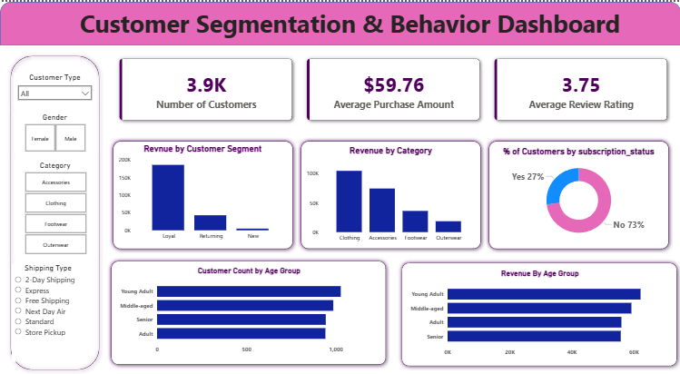

# Customer Segmentation & Behavior Analysis using Python, SQL, and Power BI

This project analyzes customer shopping behavior using Python, SQL, and Power BI to identify customer segments, revenue patterns, and business insights that support better marketing and retention strategies.

---

## Project Workflow

Raw Data → Data Cleaning (Python) → SQL Analysis → Power BI Dashboard → Business Insights
---

## 📌 Table of Contents

* <a href="#overview">Overview</a>
* <a href="#business-problem">Business Problem</a>
* <a href="#dataset">Dataset</a>
* <a href="#tools--technologies">Tools & Technologies</a>
* <a href="#project-structure">Project Structure</a>
* <a href="#data-cleaning--preparation">Data Cleaning & Preparation</a>
* <a href="#exploratory-data-analysis-eda">Exploratory Data Analysis (EDA)</a>
* <a href="#research-questions--key-findings">Research Questions & Key Findings</a>
* <a href="#insights">Key Insights</a>
* <a href="#dashboard">Dashboard</a>
* <a href="#how-to-run-this-project">How to Run This Project</a>
* <a href="#final-recommendations">Final Recommendations</a>
* <a href="#author--contact">Author & Contact</a>

---

<h2><a class="anchor" id="overview"></a>Overview</h2>

This project analyzes customer data to segment customers based on revenue contribution and identify high-value groups to support better business decisions in marketing and retention strategy.

---

<h2><a class="anchor" id="business-problem"></a>Business Problem</h2>


Businesses often struggle to identify which customer segments and demographic groups generate the most revenue and engagement. Without this insight, companies cannot effectively target retention strategies or optimize marketing efforts.

This project analyzes customer behavior data to segment customers into Loyal, Returning, and New groups, and evaluates revenue patterns across categories and age groups to support data-driven business decisions.s

---

<h2><a class="anchor" id="dataset"></a>Dataset</h2>

* Rows: 3,900
* Columns: 18
* Key Features:

  * Customer demographics (Age, Gender, Location, Subscription Status)
  * Purchase details (Item Purchased, Category, Purchase Amount, Season, Size, Color)
  * Behavioral data (Discount Applied, Previous Purchases, Frequency, Review Rating, Shipping Type)
* Missing Values:

  * 37 missing values in the `Review Rating` column

---

<h2><a class="anchor" id="tools--technologies"></a>Tools & Technologies</h2>

* Python (Pandas, NumPy, Matplotlib, Seaborn)
* SQL (PostgreSQL for data analysis)
* Power BI (Interactive dashboard creation)
* GitHub

---

<h2><a class="anchor" id="project-structure"></a>Project Structure</a></h2>

```
customer-shopping-behavior-analysis/
│
├── README.md
│
├── data/
│   └── customer_shopping_behavior.csv
│
├── notebooks/
│   └── exploratory_data_analysis.ipynb
│
├── sql/                           
│   └── analysis_queries.sql
│
├── dashboard/
│   └── customer_behavior_dashboard.pbix
│
├── reports/
│   └── Customer Shopping Behavior Analysis.pdf
│
├── presentations/
│   └── Customer-Shopping-Behavior-Analysis.ppt

```
---

<h2><a class="anchor" id="data-cleaning--preparation"></a>Data Cleaning & Preparation</h2>

* Loaded dataset using Pandas
* Performed initial exploration using `.info()` and `.describe()`
* Handled missing values:

  * Imputed `Review Rating` using median values within each product category
* Standardized column names to snake_case
* Feature Engineering:

  * Created `age_group` column
  * Derived `purchase_frequency_days`
* Removed redundant columns:

  * Dropped `promo_code_used` due to duplication with discount data
* Loaded cleaned data into PostgreSQL for further analysis

---

<h2><a class="anchor" id="exploratory-data-analysis-eda"></a>Exploratory Data Analysis (EDA)</h2>

- Performed initial data inspection using `.info()` and `.describe()` to understand data types and distributions  

- Identified missing values:
  - Found 37 missing values in `review_rating`
  - Imputed missing values using median rating within each product category 

- Feature engineering:
  - Created `age_group` to segment customers
  - Derived `purchase_frequency_days` for behavioral insights
  - Developed `customer_segment` to classify customers as New, Returning, or Loyal based on purchase history

  - Data consistency checks:
  - Verified redundancy between `discount_applied` and `promo_code_used`
  - Dropped unnecessary columns  

---
<h2><a class="anchor" id="research-questions--key-findings"></a>Research Questions & Key Findings</h2>

1. **Revenue by Gender**
   - Compared total revenue generated by male vs female customers  

2. **High-Spending Discount Users**
   - Identified customers who used discounts but still spent above average  

3. **Top Rated Products**
   - Found products with the highest average review ratings  

4. **Shipping Type Impact**
   - Compared average purchase amount between Standard and Express shipping  

5. **Subscribers vs Non-Subscribers**
   - Analyzed differences in revenue and spending behavior based on subscription status  

6. **Customer Segmentation**
   - Segmented customers into New, Returning, and Loyal based on purchase history  

---
<h2><a class="anchor" id="insights"></a>Key Insights</h2>

- Loyal customers represent **3,116 out of 3,900 customers (~80%)**, indicating strong repeat purchasing behavior.  
  **Business Impact:** Retention strategies should focus on loyal customers to maintain stable revenue.

- Non-subscribers generate higher revenue (**$170,436**) compared to subscribers (**$62,645**).  
  **Business Impact:** Increasing subscription adoption can improve recurring revenue and customer engagement.

- Young Adult customers contribute the highest revenue (**$62,143**) among all age groups.  
  **Business Impact:** Marketing campaigns should prioritize high-performing age groups to maximize revenue.

- Express shipping users spend slightly more on average (**$60.48**) than Standard shipping users (**$58.46**).  
  **Business Impact:** Promoting faster delivery options can increase customer spending.

- The Clothing category generates the highest revenue compared to other product categories.  
  **Business Impact:** Businesses should prioritize inventory and promotions for high-demand product categories.
---

<h2><a class="anchor" id="dashboard"></a>Dashboard</h2>

- Interactive Power BI dashboard includes:
  - Revenue analysis
  - Customer segmentation
  - Product performance
  - Demographic insights  




---

<h2><a class="anchor" id="how-to-run-this-project"></a>How to Run This Project</h2>

1. Clone the repository:

```bash
git clone https://github.com/yourusername/customer-shopping-behavior-analysis.git
```

2. Install required libraries:

```bash
pip install -r requirements.txt
```

3. Run data cleaning script:

```bash
python scripts/data_cleaning_and_ingestion.py
```

4. Open Jupyter Notebook:

```bash
jupyter notebook
```

5. Open Power BI dashboard:

   * `dashboard/customer_behavior_dashboard.pbix`

---

<h2><a class="anchor" id="final-recommendations"></a>Final Recommendations</h2>

- Strengthen loyalty programs to retain high-value customers, as Loyal customers represent ~80% of the customer base (3,116 customers).

- Promote subscription plans through targeted offers and incentives to increase recurring revenue, since non-subscribers currently generate the majority of revenue.

- Focus marketing campaigns on Young Adult and Middle-aged customers, as these groups contribute the highest revenue.

- Optimize inventory and promotions for high-performing product categories like Clothing to maximize sales and profitability.

- Encourage use of express shipping options by offering delivery incentives, as customers using express shipping tend to spend slightly more per purchase.

---

<h2><a class="anchor" id="author--contact"></a>Author & Contact</h2>

**Kirti Kathuria**  
Data Analyst  

📧 Email: kirtikathuria8@gmail.com
🔗 LinkedIn: https://www.linkedin.com/in/kirti-kathuria/
